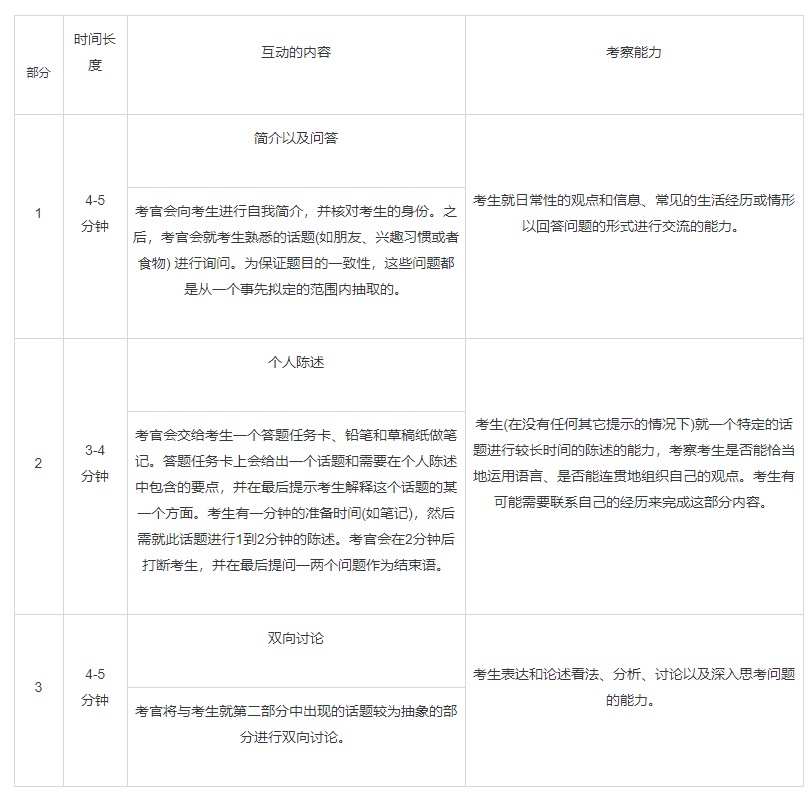

# 雅思考试介绍

>  想要了解最新的雅思资料，还是要进[官网](https://www.chinaielts.org/guide)先看看

## 考试类型

A：Academic

G：General Training

这里只介绍 Academic 类型的考试。

学术类考试评估考生的英语水平是否满足学术环境及高等教育的要求。考试适合所有考生，与其学习专业无关。

- 听力（30分钟）

  30分钟，并有10分钟时间将答案誊写到答题卡

  • 4段独白和对话

- 阅读（60分钟）

  • 3段文章及相应问题
  • 文章类型包括从描述性到阐明事实性，从散漫性到分析性
  • 也包含非文字性内容，例如图表、曲线或插图
  • 文章取自真实出版物（例如选自书籍，期刊和报纸）

- 写作（60分钟）

  • 一篇150字的文章，需要考生进行分析、描述或说明一张表格，曲线图，柱状图或示意图
  • 一篇250字的议论性文章

- 口语（11至14分钟）

  • 面对面的形式
  • 包括几个简短问题，针对某熟悉话题进行阐述以及针对该话题的讨论

## 听力

听力考试分为四个部分，每个部分有10道题，每题1分。问题的排列顺序和答案在听力材料中出现的顺序一致。在播放听力材料过程中，考生会获得读题、写下答案以及检查答案的时间。考生应在播放听力材料的时把答案写在问卷中。在听力材料播放完毕后考生有10分钟的时间把答案转抄到答题卡上。每段听力材料**只播放一次**，材料中会出现多种不同的英语口音，包括英式、澳洲式、新西兰式和美式。
**听力材料内容**

| **部分** | **话题范围** | **材料内容**                                                 | **主要的考察重点**                                           | **题目数量** |
| -------- | ------------ | ------------------------------------------------------------ | ------------------------------------------------------------ | ------------ |
| 1        | 社会生活     | 双向交流的**谈话**（如关于旅行安排的对话）                   | 理解和记录特定的事实性信息                                   | 10           |
| 2        | 社会生活     | 具有交流目的的**独白** (如介绍博物馆开放时间)                | 理解和记录特定的事实性信息                                   | 10           |
| 3        | 教育和培训   | 2-4人在学术环境下的**讨论** (如辅导或讨论会；老师和学生关于作业的讨论) | 理解涉及语义猜测的对话。理解特定的信息、态度和发言者的看法。 | 10           |
| 4        | 教育和培训   | 在学术环境下的**独白** (如一般性学术话题的讲课内容)          | 理解学术论证。理解特定的信息、态度和发言者的看法。           | 10           |

### **题目形式**

雅思考试听力部分的题型多样，主要的题型有：

**题型1  完成填表/记笔记/流程图/总结**

**题型2 选择题**

**题型3 填空题**

**题型4 完成句子**

**题型5 为图表、计划或地图进行标记**

**题型6  分类**

**题型7 配对**

### **题型一 完成填表/记笔记/流程图/总结**

考生需对听力材料的要点进行填空。在除总结以外的其他情况下，**笔记形式**的答案可以被接受为正确答案，也就是说在不影响语义的情况下冠词、助动词等可以省略。总结类型的题目使用的是互相连接的句子，因此必须符合语法的规范。考生需要根据听力材料找到对应表格/笔记等中空缺的单词。在这种情况下，考生不能以任何方式改变听力材料中所出现的单词，并需按照题目指示中规定的字数作答。
这种题型可能出现的形式有：

1. 表格：通常用来记录事实性的信息(如名字)。 
2. 一组笔记：用来总结任何形式的信息，采用相应的格式来表示不同内容之间的关系。 
3. 表格：用来总结分类清晰的信息(如地点、时间或价格)。 
4. 流程表：用来总结阶段清晰的信息，并用箭头表示过程的顺序。 
5. 总结：用来总结完整信息。

### **题型二 选择题**

题目可能已经给出句子的前半部分，考生需在选项中选择一个最佳答案完成这个句子。题目也可能是一个完整的问题，考生需在选项中选择一个最佳的答案作答。考生需要从**三个**可供选择的答案A、B、或C选择一个最佳的答案或句子结尾。

### **题型三 填空题**

考生先阅读一组句子，这些句子对听力材料中部分或者全部内容进行了总结。考生需使用听力材料中的信息对每个句子的空格以简短的方式进行填空作答。题目的指示中会对字数要求进行限定，通常为不超过三个单词和/或一个数字。考生所用的单词应该是直接从听力材料中所听到的单词。如果考生填写了超过问题指示中所要求的字数，即使所填的内容中包含正确的答案，也会被扣分。缩写的单词不会被作为考试的内容。带有连字符的单词按照一个单词计算。

### **题型四 完成句子**

考生先阅读一组句子，这些句子对听力材料中部分或者全部内容进行了总结。考生需使用听力材料中的信息对每个句子的空格进行填空作答。题目的指示中会对字数要求进行限定，通常为不超过三个单词和/或一个数字。考生所用的单词应该是直接从听力材料中所听到的单词。考生需将答案写在答卷的空格上，之后再把答案转抄至答卷上。如果考生填写了超过问题指示中所要求的字数，即使所填的内容中包含正确的答案，也会被扣分。缩写的单词不会被作为考试的内容。带有连字符的单词按照一个单词计算。

### **题型五 为图表、计划或地图进行标记**

考生需在一个图形上完成标记工作。通常问卷中会有一组可供选择的答案，考生需在规定的时间内把所选的答案所对应的字母填写在答卷上。
图形通常有以下形式：

-  画图(如一个仪器设备)
- 一组图
- 平面图 (如一个建筑的平面图)
- 地图 (如城市地图的一部分)

### **题型六 分类**

考生需按照一组要求对听力材料中出现的内容进行分类。这种题型考察的是考生判断听力材料中出现的事实情况之间的关系和关联的能力，考生应具有**听力理解细节的能力**。

### **题型七 配对**

考生需将听力材料中出现的内容与题目中出现的内容进行配对，并将所对应的内容填入空格中。

## 阅读

雅思考试阅读(学术类)部分共有三篇文章，考生需要回答40道题目。每一篇文章所需要回答的问题数量并不相同。每一道问题相对应一个分数。文章内容和题目均出现于试卷中。

### **文章介绍**

阅读考试中所出现的文章是由真实的文章改写而成的。这些文章来源于诸如杂志、期刊、书籍和报纸等途径，与考生未来在大学课程中将阅读到的文章极为相似。文章还包括了非文字性的内容，比如图表、曲线图、以及画图等。文章的写作方式多样，比如记叙文、说明文或者议论文等文体。文章的内容包含即将学习本科、研究生课程或进行职业注册的考生所感兴趣的、与其认知程度相符的常见话题。其中，至少一篇文章会出现详尽的论述形式。所有文章总计长度约在2000到2750字之间。

### **题目形式**

雅思考试阅读(学术类)部分共有以下10种题型，其中一些会有少许的变化。这些题型是：

**题型一 选择**

**题型二 填空**

**题型三 完成句子**

**题型四 完成笔记、总结、表格或流程图**

**题型五 对图表进行标记**

**题型六 为段落或文章的部分选择相对应的小标题**

**题型七 寻找信息**

**题型八 寻找作者观点、论点或文章中的具体信息**

**题型九 分类**

**题型十 配对**

**提示：**

- 应仔细阅读题目的指示和说明，这些信息会告诉你**在哪里寻找答案**、需要**如何回答问题**、以及答案**字数的限定**。题目里的指示还会说明答案**是否可以多次使用**，并提醒你把答案转抄到答卷上。
- 注意**大多数的题型**下，题目出现的顺序和信息在文章中出现的**顺序都是一致**的。
- 进行**跳读**、**扫读**练习，以便能在文章片段中快速寻找与题目相关的关键词。将**关键词和词组**用下划线标记出来，并注意**题目中的关键词**与**文中关键词**的联系。在大多数情况下(如填空题)，你所填写的答案需符合正确的语法要求。<u>正确的单词拼写和词组搭配</u>是非常重要的，出现错误是要被扣分的。
- 在**大多数情况下**，你可以在文章里找到需要填写的单词，并应将这个词仔细正确地抄在答卷上。运用笔记、表格、图表或流程图中的内容以及范例来预测答案所涉及的信息的类型。
- 在辅导课上，与同学和老师讨论每种题型下答案可能出现的形式。
- 熟悉同义词以及带有概括作用的词汇，这可以帮助你找到相关信息。
- 练习如何用不同的方式表达相同的意思和信息。
- 思考某些信息之间有什么共性、又有什么不同之处。
- 题海战术并不能让考生按照希望的那样快速提高成绩，这对备考和英语学习是不利的。备考的过程中应该广泛阅读不同的材料，如报纸、期刊、杂志和书籍，并利用这些资源为备考服务。
- 注意熟悉不同的文体，并且练习如何更好地理解这些文体。在练习中熟悉所有雅思考试阅读(学术类)的题型。
- 要注意阅读的方法不止一种。考试的主要任务是找到题目的答案，因此考试中运用的阅读技巧与你需要记忆内容时所用的阅读技巧是不同的。考试过程中不应过于担心出现的生词，同时应该在平时多加练习如何根据上下文的语义来猜测生词的意思，尽量不要用字典查每一个生词，而打断了阅读的连贯性。
- 在任何时候都要认真阅读题目的指示。如果不明确题目的要求，你是很容易出现混淆而导致出错的。
- 在阅读的时候应该注意时间限制，避免在某一道题目上花费过多的时间。
- 注意不要过于依赖于从文中寻找某个词来作答。你应该练习如何改述、在文中找到改述的内容。

## 写作

雅思考试写作(学术类)部分总共用时60分钟，考生需完成两篇作文的写作要求。

### **作文一**

在作文一中，题目中会给出一些视觉性的信息，如一个或多个互相关联的图表、图解或表格，考生需对这些信息或数据进行描述。

题目也可以是一个机械图、装置图、或流程图，考生需对其运作方法进行解释。作文一的内容是学术性的，因此考生应该**运用学术写作的文体**。

文章字数不能少于150字，建议考生用20分钟完成。**作文一考察的是**考生在图表或表格中选择最重要和最相关的信息（一些次要的信息则可忽略）、并对这些信息进行清晰描述的能力，考官将对考生组织这些信息的能力以及语言使用的准确性进行评分。

#### 作文一是如何进行评分的？

考官将从以下方面对作文进行评分：

- 是否完成了写作要求：考生能否有效地找到信息中关键的内容并对之进行描述和写作
- 连贯性和结构层次：考生能否将信息和要点进行组织，信息和要点之间的联系是否清晰；
- 词汇来源：考生使用的词汇是否广泛、准确、且适合这一部分写作的要求；
- 语法的多样性和准确性：考生使用的语法结构是否多样、准确、且适合这一部分写作的要求。

#### 有什么需注意的方面？

- 考生需将作文写在答卷上；
- 考生应保证字数至少达到150字，否则将会被扣分。字数多于150字不会被扣分，但考生应注意如果在作文一花费太长时间，则作文二的用时将会减少。
- 文章内容如果偏题或者跑题将被扣分；
- 任何抄袭(如抄袭其他来源的内容)的作文将被重扣；
- 文章如果不完整、内容相互没有关联将被扣分(如在任何部分使用点句或笔记形式)。

### **作文二**

在作文二中，题目中会给出一个看法、问题或议题，考生需就此进行论述。

根据不同的情况，考生可能需要针对问题提出解决方法、论述和证明一个看法、对比和对照论据或看法、或者评价和反驳一个论点或观点。

这篇作文的内容是学术性的，因此考生应该运用**正规的学术写作的、议论性的文体**。考生应注意完整地阅读并回答题目中涉及的问题。

考生应在写作中注意**对所有的观点**加以充分论述，并且**所有的观点都与论点有关**。考生应严密地安排选择论点、选择最为相关的论点，并在规定的时间内清晰、准确地写作成文。

文章字数不能少于250字，建议考生用40分钟完成。作文二比作文一所占的分数比例要大，如果考生没有完成这部分内容成绩将大打折扣。

**这一部分考察的是**考生对一个论点进行论述、并提供清晰的论据或举例支持论点的能力。考官将对考生组织这些信息的能力以及语言使用的准确性进行评分。

#### 作文二是如何进行评分的？

考官将从以下方面对作文进行评分：
- 对写作任务的反应：考生能否完整地、以恰当的方式完成题目中提出的写作任务；考生的论点是否切中题目的要求、论证过程是否完整、论点是否得到了论据的支持；考生的观点是否清晰和有效；
- 连贯性和结构层次：考生能否将信息和要点进行组织(如运用分段的能力)、信息和要点之间的联系是否清晰；
- 词汇来源：考生使用的词汇是否广泛、准确、且适合这一部分写作的要求；
- 语法的多样性和准确性：考生使用的语法结构是否多样、准确、且适合这一部分写作的要求。

有什么需注意的方面？

- 考生需将作文写在答卷上；
- 考生应保证字数至少达到250字，否则将会被扣分。字数多于250字不会被扣分，但字数过长，则考生将没有充足的时间进行检查和校对、某些观点会跑题、或由于着急出现字迹过于潦草的情况。
- 文章内容如果偏题或者跑题将被扣分；
- 任何抄袭(如抄袭其他来源的内容)的作文将被重扣；
- 文章如果不完整、内容相互没有关联将被扣分(如在任何部分使用点句或笔记形式)；注意不要直接从答卷中抄下题目，这样的内容将不获评分；
- 考生须使用自己的语言进行写作；

## 听力

雅思考试口语部分通过考生与考官之间进行一对一交流的形式对考生的英语口语水平进行考察。考官将在口语考试全程对考生表现进行评分。口语考试分为三个部分，考生可以以此使用不同的口语表达技能。雅思考试口语部分将被录音。

