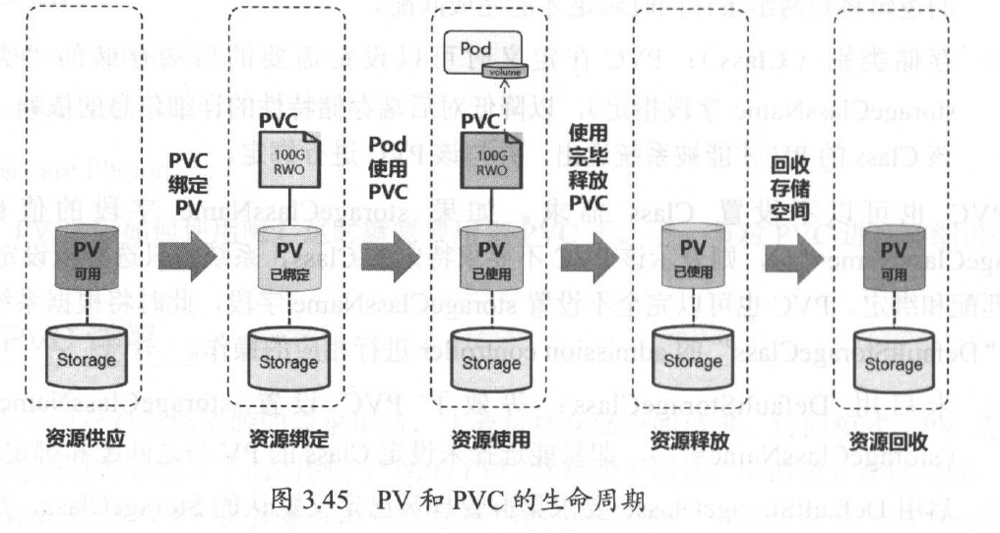

# k8s存储

参考：K8S权威指南

## Volume

Volume 是Pod 中能够被多个容器访问的共享目录。Kubernetes 的Volume 概念、用途和目的与Docker 的Volume 比较类似，但两者不能等价。首先， Kubernetes 中的Volume 定义在Pod上，然后被一个Pod 里的多个容器挂载到具体的文件目录下；其次， Kubernetes 中的Volume 与Pod 的生命周期相同，但与容器的生命周期不相关，当容器终止或者重启时， Volume 中的数据也不会丢失。最后， Kubernetes 支持多种类型的Volume ，例如GlusterFS 、Ceph 等先进的分布式文件系统。

## Persistent Volume

之前我们提到的Volume 是定义在Pod 上的，属于“计算资源”的一部分，而实际上，“网络存储”是相对独立于“计算资源”而存在的一种实体资源。比如在使用虚拟机的情况下，我们通常会先定义一个网络存储，然后从中划出一个“网盘”并挂接到虚拟机上。Persistent Volume（简称PV ）和与之相关联的Persistent Volume Claim （简称PVC ）也起到了类似的作用。**PV 可以理解成Kubernetes 集群中的某个网络存储中对应的一块存储**，它与Volume 很类似，但有以下区别。

- PV 只能是网络存储，不属于任何Node ，但可以在每个Node 上访问。
- PV 并不是定义在Pod 上的，而是独立于Pod 之外定义。
- PV 目前支持的类型包括： gcePersistentDisk 、AWSElasticBlockStore 、AzureFile 、AzureDisk 、FC ( Fibre Channel ） 、Flocker、NFS 、iSCSI 、RBD (Rados Block Device ）、CephFS 、Cinder、GlusterFS 、V sphere Volume 、Quobyte Volumes 、VMware Photon 、Portworx Volumes 、ScaleIO Volumes 和HostPath （仅供单机测试）。

PV 是有状态的对象，它有以下几种状态。

- Available ：空闲状态。
- Bound ：己经绑定到某个PVC 上。
- Released ：对应的PVC 己经删除，但资源还没有被集群收回。
- Failed: PV 自动回收失败。

## 共享存储原理

Kubernetes 对于有状态的容器应用或者对数据需要持久化的应用，不仅需要将容器内的目录挂载到宿主机的目录或者emptyDir 临时存储卷，而且需要更加可靠的存储来保存应用产生的重要数据，以便容器应用在重建之后，仍然可以使用之前的数据。不过，**存储资源**和**计算资源(CPU／内存〉**的管理方式完全不同。为了能够屏蔽底层存储实现的细节，让用户方便使用，同时能让管理员方便管理， Kubernetes 从v1.0 版本就引入**PersistentVolume** 和**PersistentVolumeClaim**两个资源对象来实现对存储的管理子系统。

PersistentVolume (PV ）是对底层网络共享存储的抽象，将共享存储定义为一种“资源”，比如节点（ Node ）也是一种容器应用可以“消费”的资源。PV 由管理员进行创建和配置，它与共享存储的具体实现直接相关，例如GlusterFS 、iSCSI 、RBD 或GCE/AWS 公有云提供的共享存储，通过插件式的机制完成与共享存储的对接，以供应用访问和使用。

PersistentVolumeClaim (PVC ）则是用户对于存储资源的一个**“申请”**。就像**Pod “消费”Node 的资源**一样， **PVC 会“消费” PV 资源**。PVC 可以申请特定的存储空间和访问模式。

使用PVC “申请”到一定的存储空间仍然不足以满足应用对于存储设备的各种需求。通常应用程序都会对存储设备的特性和性能有不同的要求，包括**读写速度**、**并发性能**、**数据冗余**等更高的要求， Kubernetes 从v1.4 版本开始引入了一个新的资源对象StorageClass ，用于标记存储资源的特性和性能。到v1.6 版本时， StorageClass 和动态资源供应的机制得到了完善，实现了存储卷的按需创建，在共享存储的自动化管理进程中实现了重要的一步。

通过 StorageClass 的定义，管理员可以将存储资源定义为某种类别（ Class ），正如存储设备对于自身的配置描述（ Profile ），例如“快速存储”、“慢速存储”、“有数据冗余”、“无数据冗余”等。用户根据 StorageClass 的描述就能够直观得知各种存储资源的特性，就可以根据应用对存储资源的需求去申请存储资源了。

### PV

PV 作为存储资源，主要包括存储能力、访问模式、存储类型、回收策略、后端存储类型等关键信息的设置。

```yaml
apiVersion : v1
kind: PersistentVolume
metadata:
	name: pvl
spec :
	capacity :
		storage: 5Gi
	accessModes:
		- ReadWriteOnce
persistentVolurneReclairnPolicy: Recycle
storageClassNarne: slow
nfs:
	path: /tmp
	server: 172.17.0.2
```

上面的例子声明的 PV 具有如下属性： 

- 5Gi 存储空间
- 访问模式为“ ReadWriteOnce ”
- 存储类型为“ slow ”（要求系统中己存在名为slow 的StorageClass ）
- 回收策略为“ Recycle ”
- 后端存储类型为 “nfs”（设置了NFS Server 的IP 地址和路径）。

### PVC

定义PV之后怎么使用呢？

PVC 作为用户对存储资源的需求申请，主要包括存储空间请求、访问模式、PV 选择条件和存储类别等信息的设置。下面的例子声明的PVC 具有如下属性：

- 申请8Gi 存储空间
- 访问模式为“ ReadWriteOnce “
- PV 选择条件为包含标签“ release=stable ” 并且包含条件为“ environment In [dev］” 的标签
- 存储类别为 “ slow ”（要求系统中己存在名为slow 的StorageClass):

```yaml
kind: PersistentVolumeClaim
apiVersion: vl
metadata:
	name: myclaim
spec:
	accessModes:
		- ReadWriteOnce
resources :
	requests :
		storage: 8Gi
storageClassName : slow
selector:
	matchLabels:
		release :”stable ”
matchExpressions:
	- {key: environment , operator: In, values: [dev]}
```

PVC 的关键配置参数说明如下。

- **资源请求（ Resources ）**：描述对存储资源的请求，目前仅支持request.storage 的设置，即存储空间大小。
- **访问模式（ Access Modes)**: PVC 也可以设置访问模式，用于描述用户应用对存储资源的访问权限。可以设置的三种访问模式与PV 的设置相同。
- **PV 选择条件（ Selector ）**：通过Label Selector 的设置，可使PVC 对于系统中己存在的各种PV 进行筛选。系统将根据标签选择出合适的PV 与该PVC 进行绑定。选择条件可以使用matchLabels 和matchExpressions 进行设置，如果两个字段都设置了，则Selector
  的逻辑将是两组条件同时满足才能完成匹配。
- **存储类别（ Class)**: PVC 在定义时可以设定需要的后端存储的“ 类别” （通过storageClassN ame 字段指定），以降低对后端存储特性的详细信息的依赖。只有设置了该Class 的PV 才能被系统选出，并与该PVC 进行绑定。

## 生命周期



### 资源供应（Provisioning)

Kubemetes 支持两种资源的供应模式：静态模式（ Static ）和动态模式（ Dynamic ）。资源供应的结果就是创建好的PV 。

- 静态模式：集群管理员手工创建许多 PV ，在定义 PV 时需要将后端存储的特性进行设置。

- 动态模式：集群管理员无须手工创建 PV，而是通过 StorageClass 的设置对后端存储进行描述，标记为某种 “类型（ Class ）”。此时要求PVC 对存储的类型进行声明，系统将自动完成 PV 的创建及与 PVC 的绑定。PVC 可以声明Class 为 ”” ，说明该PVC 禁止使用动态模式。

### 资源绑定（Binding)

在用户定义好 PVC 之后，系统将根据 PVC 对存储资源的请求（存储空间和访问模式）在己存在的 PV 中选择一个满足 PVC 要求的PV ， 一旦找到，就将该PV 与用户定义的PVC 进行绑定，然后用户的应用就可以使用这个PVC 了。

如果系统中没有满足PVC 要求的PV, PVC则会无限期处于Pending 状态，直到等到系统管理员创建了一个符合其要求的PV 。PV 一旦绑定到某个PVC 上，就被这个PVC 独占，不能再与其他PVC 进行绑定了。

在这种情况下，当PVC 申请的存储空间比PV 的少时，整个PV 的空间都能够为PVC 所用，可能会造成资源的浪费。如果资源供应使用的是动态模式，则系统在为PVC 找到合适的StorageClass 后，将自动创建一个 PV 并完成与PVC 的绑定。

### 资源使用（Using）

Pod 使用volume 的定义，将PVC 挂载到容器内的某个路径进行使用。

volume 的类型为“ persistentVolumeClaim”。在容器应用挂载了一个PVC 后，就能被持续独占使用。不过，多个Pod 可以挂载同一个PVC ， 应用程序需要考虑多个实例共同访问一块存储空间的问题。

### 资源释放（Releasing）

当用户对存储资源使用完毕后，用户可以删除PVC ， 与该PVC 绑定的PV 将会被标记为“己释放“，但还不能立刻与其他PVC 进行绑定。通过之前PVC 写入的数据可能还留在存储设备上，只有在清除之后该PV 才能再次使用。

### 资源回收（Reclaiming）

对于PV ， 管理员可以设定回收策略（ Reclaim Policy ），用于设置与之绑定的PVC 释放资源之后，对于遗留数据如何处理。只有PV 的存储空间完成回收，才能供新的PVC 绑定和使用。回收策略详见下节的说明。

下面通过两张图分别对在静态资源供应模式和动态资源供应模式下， PV 、PVC 、StorageClass及Pod 使用PVC 的原理进行说明。