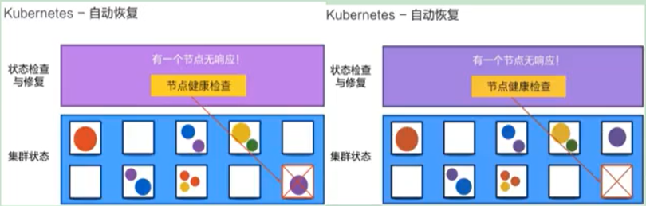
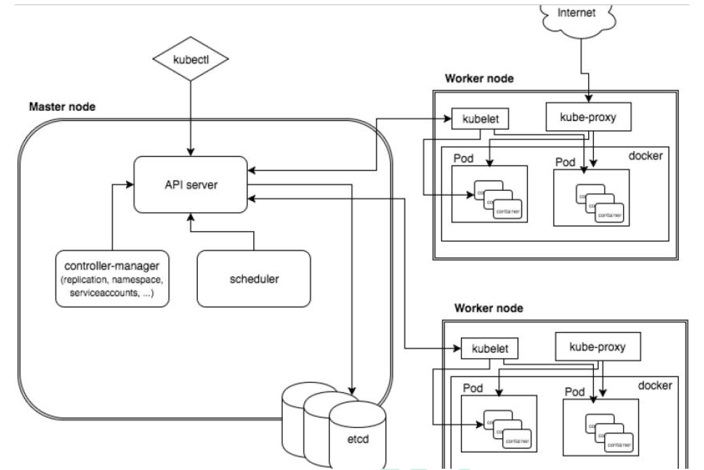
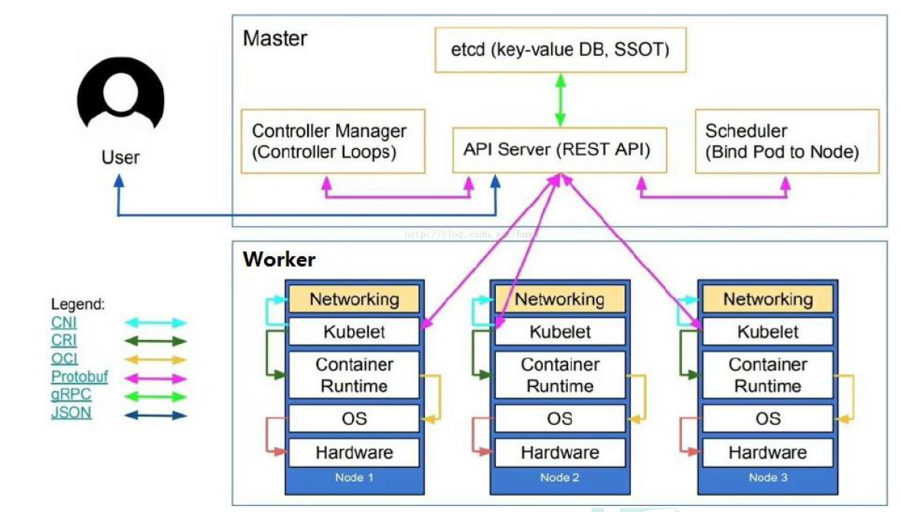
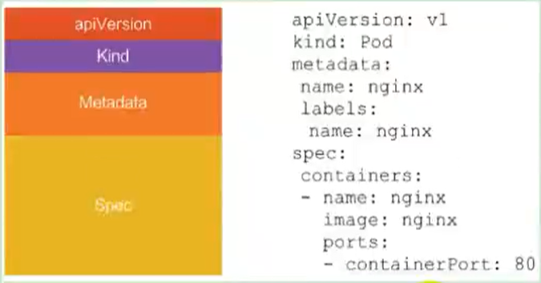

# K8S理论

## 特点

### 自动装箱

基于容器对应用运行环境的资源配置要求自动部署应用容器

### 自我修复(自愈能力)

当容器失败时，会对容器进行重启

当所部署的Node节点有问题时，会对容器进行重新部署和重新调度

当容器未通过监控检查时，会关闭此容器直到容器正常运行时，才会对外提供服务


如果某个服务器上的应用不响应了，Kubernetes会自动在其它的地方创建一个



### 水平扩展

通过简单的命令、用户UI 界面或基于CPU 等资源使用情况，对应用容器进行规模扩大或规模剪裁

> 当我们有大量的请求来临时，我们可以增加副本数量，从而达到水平扩展的效果

当黄色应用过度忙碌，会来扩展一个应用


### 服务发现

用户不需使用额外的服务发现机制，就能够基于Kubernetes 自身能力实现服务发现和负载均衡

> 对外提供统一的入口，让它来做节点的调度和负载均衡， 相当于微服务里面的网关？


### 滚动更新

可以根据应用的变化，对应用容器运行的应用，进行一次性或批量式更新

> 添加应用的时候，不是加进去就马上可以进行使用，而是需要判断这个添加进去的应用是否能够正常使用

### 版本回退

可以根据应用部署情况，对应用容器运行的应用，进行历史版本即时回退

> 类似于Git中的回滚

### 密钥和配置管理

在不需要重新构建镜像的情况下，可以部署和更新密钥和应用配置，类似热部署。

### 存储编排

自动实现存储系统挂载及应用，特别对有状态应用实现数据持久化非常重要

存储系统可以来自于本地目录、网络存储(NFS、Gluster、Ceph 等)、公共云存储服务

### 批处理

提供一次性任务，定时任务；满足批量数据处理和分析的场景

## 架构



k8s是主从服务器的架构实现。下图的上部分是master的架构。



**master**：主控节点

- API Server：**集群统一入口**，以restful风格进行操作，同时交给etcd存储
  - 提供认证、授权、访问控制、API注册和发现等机制
- scheduler：**节点的调度**，选择node节点应用部署
- controller-manager：处理集群中常规后台任务，一个资源对应一个控制器（例如订单管理里，有一个控制器；用户管理有一个控制器）
- etcd：存储系统，用于保存集群中的相关数据


**Work node**：工作节点

- Kubelet：master派到node节点的代表，管理本机容器
  - 一个集群中每个节点上运行的代理，它保证容器都运行在Pod中
  - 负责维护容器的生命周期，同时也负责Volume(CSI) 和 网络(CNI)的管理
- kube-proxy：提供网络代理，负载均衡等操作

## 核心概念

### Pod

- Pod是 K8s 中最小的单元
- 一组容器的集合
- 共享网络【一个Pod中的所有容器共享同一网络】(第一个容器监听80端口，另外的容器也能得到这个端口)
- 生命周期是短暂的（服务器重启后，就找不到了）


### Controller

- 确保预期的pod副本数量【ReplicaSet】
- 无状态应用部署【Depoltment】
  - 无状态就是指，不需要依赖于网络或者 ip
- 有状态应用部署【StatefulSet】
  - 有状态需要特定的条件
- 确保所有的node运行同一个pod 【DaemonSet】
- 创建一次性任务和定时任务【Job和CronJob】

### Service

- 定义一组pod的访问规则（路由？）
- Pod的负载均衡，提供一个或多个Pod的稳定访问地址
- 支持多种方式【ClusterIP、NodePort、LoadBalancer】


可以用来组合pod，同时对外提供服务


```note
通过 service 统一路径进行访问，再通过 controller 创建对应的 pod 进行部署
```


### Volume

- 声明在Pod容器中可访问的文件目录
- 可以被挂载到Pod中一个或多个容器指定路径下
- 支持多种后端存储抽象【本地存储、分布式存储、云存储】

### Deployment

- 定义一组Pod副本数目，版本等
- 通过控制器【Controller】维持Pod数目【自动回复失败的Pod】
- 通过控制器以指定的策略控制版本【滚动升级、回滚等】


### Label

label：标签，用于对象资源查询，筛选


### Namespace

命名空间，逻辑隔离

- 一个集群内部的逻辑隔离机制【鉴权、资源】
- 每个资源都属于一个namespace
- 同一个namespace所有资源不能重复
- 不同namespace可以资源名重复

### API

我们通过Kubernetes的API来操作整个集群

同时我们可以通过 kubectl 、ui、curl 最终发送 http + json/yaml 方式的请求给API Server，然后控制整个K8S集群，K8S中所有的资源对象都可以采用 yaml 或 json 格式的文件定义或描述

如下：使用yaml部署一个nginx的pod

