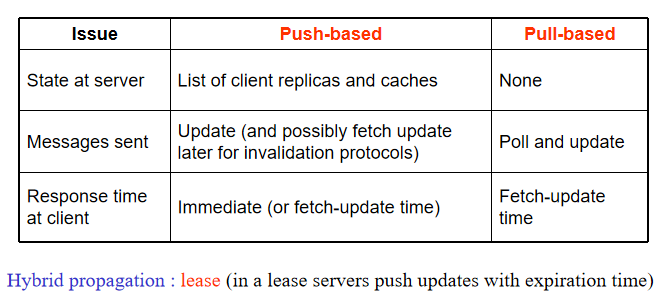

# 一致性
为了提高分布式系统的可用性，有很多手段。数据复制是其中一种。

在多副本的情况下：
- 如果一台服务器不可用了，就可以切换到其他的服务器
- 有了多个数据副本后，就可以使请求数据分流，减少单台服务器的压力

但也带来了问题，一致性问题：这个副本可能与另一个副本不一致。例如：值X在节点M和N上都有副本，客户端A
修改了M上的X，过了一段时间后，客户端B在N上看到的值是什么值？

进一步将这个问题扩展：
- 客户端A修改了好多次M上的X
- 进一步细分时间
- ...

根据上面的问题就引入了一致性模型
## 一致性模型
[不同的资料](https://zhuanlan.zhihu.com/p/58952564)中对于一致性模型的解释并不是完全一样的。


### 以数据为中心的一致性
综合现有的资料，一致性模型有以下几种
- Strict一致性
- Linearizability一致性
- Sequential一致性
- Casual一致性
- FIFO一致性
- Weak一致性
- Release一致性
- Entry一致性


### Linearizability && Sequential Consistency

网上的中文资料林林总总，这个抄那个，那个抄这个，大多定义模糊，不知其所云。课件上的定义也比较抽象。

下面给出定义和[参考资料](http://kaiyuan.me/2018/04/21/consistency-concept/)：

**Linearizability** 

> The result of any execution is the same as if the read and write operations by all processes on the data store were executed in some sequential order and the operations of each individual process appear in this sequence in the order specified by its program. In addition, if tsOP1(x) < tsOP2(y), then operation OP1(x) should precede OP2(y) in this sequence

任何读取都必须读到最新写入的值

**Sequential consistency**

> The result of any execution is the same as if the read and write perations by all processes on the data store were executed in some sequential order. And the operations of each individual process appear in this sequence in the order specified by its program
>
> 所有的进程看到的操作的顺序是相同的

### Casual Consistency

比如下图中，我们认为 **P2 写入的 3 是基于它读出来的 1 计算出来的**，它读出来的 1 又是由 P1 的写入产生的，因此认为 P1 写入 1 和 P2 写入 3 具有因果关系。P4 没有观测到这个因果关系，所以这个系统不具备Causal Consistency。


而下图中，认为P2写入3和P1写入1不具有因果关系，则P4和P3可以以任意顺序观测到它们。这个系统仍然可以说具有Causal consistency，但是不具备Sequential Consistency。


再例如下面这个图，（a）中，P2 先读了x，读出来的结果是a。我们认定接下来写入的 x=b 的结果是基于之前读出来的 a 计算出来的，因此 P1 与 P2 就有了因果关系，则 P3 和 P4 读到的结果顺序则应当遵循因果一致性，即先读到 x=a，再读到 x=b。

而（b）中，则认为 P1 与 P2 是并发的，则 P3 和 P4 读到什么顺序的结果都是无所谓的。


### FIFO Consistency

一个进程所做的所有的写操作是被其他的进程按照这些写操作发出的顺序看到的。

但来自**不同进程的写操作**可能被**不同的进程**以**不同的顺序**看到的。


P2 先写 x=b，再写 x=c，则在 P3、P4 中看到的全是写入的顺序；

但 P1 和 P2 写的可能就是乱序的了。


### 以客户端为中心的一致性（Client-centric Consistency）
前面我们讨论的一致性模型都是针对数据存储的多副本之间如何做到一致性，考虑这么一种场景：

```note
在最终一致性的模型中，如果客户端在数据不同步的时间窗口内访问不同的副本的同一个数据，会出现读取同一个数据却得到不同的值的情况。

为了解决这个问题，有人提出了以客户端为中心的一致性模型。

以客户端为中心的一致性为单一客户端提供一致性保证，保证该客户端对数据存储的访问的一致性，但是它不为不同客户端的并发访问提供任何一致性保证。 
```

举个例子：客户端 A 在副本 M 上读取 x 的最新值为 1，假设副本 M 挂了，客户端 A 连接到副本 N 上，此时副本 N 上面的 x 值为旧版本的 0，那么一致性模型会**保证客户端 A 读取到的 x 的值为 1，而不是旧版本的 0**。一种可行的方案就是给数据 x 加版本标记，同时客户端 A 会缓存 x 的值，通过比较版本来识别数据的新旧，保证客户端不会读取到旧的值。

以客户端为中心的一致性包含了四种子模型：

- **单调读一致性（Monotonic-read Consistency）：**
    如果一个进程读取数据项 x 的值，那么该进程对于 x 后续的所有读操作要么读取到第一次读取的值要么读取到更新的值。即保证客户端不会读取到旧值。
- **单调写一致性（Monotonic-write Consistency）：**
    一个进程对数据项 x 的写操作必须在该进程对 x 执行任何后续写操作之前完成。即保证客户端的**写操作是串行的**。
- **读写一致性（Read-your-writes Consistency）：**
    一个进程对数据项 x 执行一次写操作的结果总是会被该进程对 x 执行的后续读操作看见。即保证客户端**能读到自己最新写入的值**。
- **写读一致性（Writes-follow-reads Consistency）：**
    同一个进程对数据项 x 执行的读操作之后的写操作，保证发生在与 x 读取值相同或比之更新的值上。即保证客户端**对一个数据项的写操作是基于该客户端最新读取的值**。（比如 x=x+1 ，如果读到的 x 不是最新的值，则 x+1 的结果是错误的，则这次写操作也将是错误的）

## 一致性协议

### 数据更新协议

#### 基于push（服务器）的协议

当需要高一致性的时候，更新会在没有请求的情况下传播到其他副本。（服务器主动推送）

#### 基于pull（客户端）的协议

更新的内容会根据要求传播到其他副本中去 



### Primary-based protocols 

主从协议，只有主服务器才有写X的权限。实现了顺序一致性。

**Remote-Write 协议**，有一个固定的服务器，所有读写操作都会被转发到这个服务器。数据是分布式的，但他们没有备份。并且相对耗时。

**Local-Write 协议**。单个副本在各个进程之间迁移，是完全的无备份的分布式存储。位置信息是数据存储中的主要问题。对于断线的计算机很有用。

### Replicated write protocols

写操作可以在很多副本中进行。每个副本都有一个相关的进程来执行更新操作。

问题：对某个数据的重复调用会产生问题（数据重复）

**Quorum-Based Protocols**

即raft的日志复制策略，日志复制到超过半数以上的节点后才提交。

### Cache-coherence protocols

由客户端来决定是否同步复制。

- Coherence detection strategy（什么时候验证：三种）
  - 不验证：假设是一致的
  - 在访问缓存的数据之前验证一致性
  - 使用了缓存的数据之后再去验证一致性
- Coherence enforcement strategy（怎么验证：三种）
  - 没有缓存共享数据（仅在服务器）
  - 服务器向所有的缓存发送失效信息
  - 服务器发送更新的缓存
- Write-through cache
  - 客户端修改缓存的数据，并且将这些更新转发给服务器

