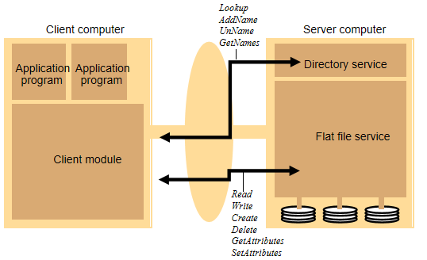

# 分布式文件系统

目标：

- 位置透明性：同一个文件命名空间，不包含特定的物理地址
- 并发透明性：一个用户的文件操作不会被其他的用户干扰
- 故障透明性：当系统的一部分发生故障时，其他部分仍可提供服务
- 异质性：可以在不同的操作系统和通信协议下工作

- 可扩展性：系统性能不会随着系统规模的增长而恶化

## 与本地文件系统的区别

- 文件服务和目录服务分离
  - 使文件服务更加通用，并且目录服务可以变得更加灵活
  - 文件服务器不必有目录服务了
- 无状态的服务器以及在客户模块上模拟
  - 文件服务器是轻量级的，大部分工作都在客户模块（状态存储在客户端）
  - 服务器可以有效地从故障中恢复
  - 客户端上模拟了传统的文件系统接口
- 可重复的操作
  - 文件操作是幂等的，允许使用至少一次的RPC语义。
  - 但创建操作不是幂等的

## [MinIO](http://www.minio.org.cn/)调研

### 对象存储-WHY

随着社交媒体，云存储，数据分析平台和其他计算范式的出现，产生了越来越多的非结构化数据。一般来说，结构化数据将会被存储进数据库，而非结构化数据被存储至文件系统。问题来了，为什么需要一个新的存储范式（对象存储）？

- 扩展文件系统很难。需要处理不必要的元数据和层次结构，还要管理备份等。
- 单纯的存储满足不了需求，通常对于用户来说还需要对存储进行某种程度的组织。比如文本分析、自动分类、自动标记。
- 文件系统是面向人类的，难以通过编程的方式操作文件系统。处理文件流和边界情况需要大量的时间和精力。

### 对象存储-WHAT

- 对象以平面结构存储，只有一个对象池，没有文件夹、目录、层次结构。只需要提供对应的ID就可以请求对象，而对象的实际位置可能在本地，也可能在云服务器上（位置透明性）。

- 对象存储可以手动添加任意类型或数量的元数据。
	
	> 例如，您可以分配元数据，例如与对象关联的应用程序的类型。应用程序的重要性；您要分配给对象的数据保护级别；是否要将此对象复制到另一个站点或多个站点；何时将该对象移动到不同的存储层或不同的地理位置；何时删除该对象。依此类推，可能性是无限的。
	
- 通过HTTP(S)访问，简化身份验证、获取文件属性和管理权限等操作。

