# 并发控制

```note
事务，具有ACID四个特性。

A：`Atomicity`，要么全部做完，要么一点都不做。

C：`Consistency`，保证事务符合一致性的操作规则，不出现三种不一致性。

I：`Isolation`，保证两个事务之间不影响互相的执行，有四种隔离级别

D：`Durablity`， 保证一旦事务提交，那么它对数据库中的对应数据的状态的变更就会永久保存到数据库中。
```

## 四种不一致性

> 更多的解释[看这里](https://zhuanlan.zhihu.com/p/150107974)

- 丢失修改

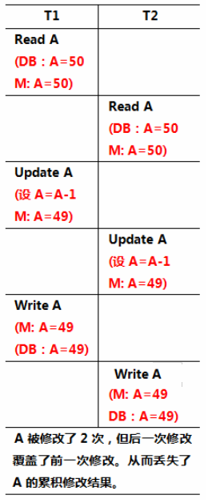

- 不可重复读（**重复读错误**）

  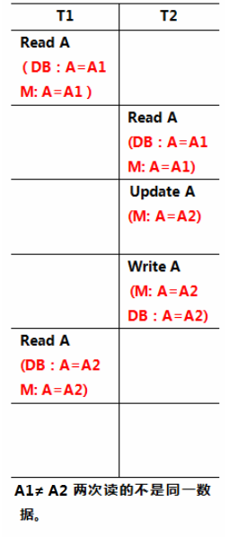

- 脏读

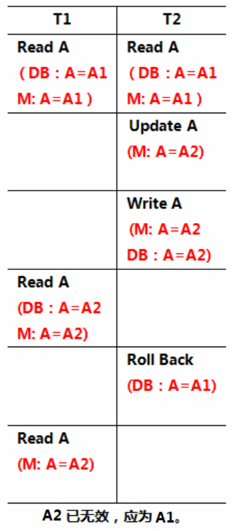

- 幻读

  一个事务在前后两次查询同一个范围的时候、后一次查询看到了前一次查询未看到的行

  产生原因：行锁只能锁住行，即使把所有的行记录都上锁，也阻止不了新插入的记录


## 可串行性、冲突可串行性

如果不管数据库初始状态如何，一个调度对数据库状态的影响都和某个串行调度相同，则我们说这个调度是**可串行化**的 (Serializable)或具有**可串行性**(Serializability)。

**冲突可串行性**： 一个调度，如果通过交换相邻两个无冲突的操作能够 转换到某一个串行的调度，则称此调度为冲突可串行化的调度。

## 冲突可串行性判别算法

实现了冲突可串行性，就实现了可串行性，就实现了并发调度的正确性。

如果事务A与B发生了冲突（读写、写读、写写），且A在B之前执行，则A指向B。如果没有环，则冲突可串行化。

## 三种并发控制方法
## 基于封锁的方法

### 四种锁

```note
排他锁 e**X**clusive locks：即互斥锁

共享锁 **S**hared locks：即读锁

更新锁 **U**pdate locks：初始是读锁，以后可升级为写/排他锁（预定了写/排他锁）

增量锁 **I**ncremental lock：增量更新（如A=A+X）[^这部分的资料较少]
```

### 加锁、解锁的四个时机（协议、隔离级别）

注意：这4个协议分别要从读者和写者进行分析。如2级协议对于读者来说还是会发生重复读错误（不可重复读）。在**上面不可重复读的示例中**，在T1读A的时候都加读锁，读完之后释放；T2写A的时候加写锁，commit之后，T1再读A，就发生了不可重复读（重复读错误）。

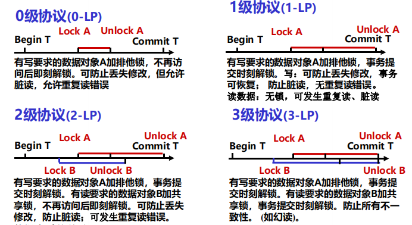

而针对下图的表述对象来说，我个人认为是描述写者的。

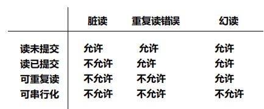

数据库中有四种隔离级别，体现了事务的**隔离特性（Isolation）**

```note
**读未提交  (read uncommitted) ---相当于0级协议**

**读已提交  (read committed) ---相当于1级协议**

**可重复读  (repeatable read) ---相当于2级协议**

**可串行化  (serializable) ---相当于3级协议**
```

### 封锁粒度

属性值->元组->元组集合->整个关系->整个DB某索引项->整个索引

### 2PL: two-Phase Locking protocal

读写数据之前要获得锁。每个事务中所有封锁请求先于任何一个解锁请求

两阶段：加锁段，解锁段。
- 加锁段中不能有解锁操作
- 解锁段中不能有加锁操作

特点 

- 加锁段不能有解锁操作，解锁段不能有加锁操作
- 可以保证冲突可串行性
- 可能产生死锁

> 一个小问：
>
> 如果读锁是共享锁的话，在一个事务读完之后可以立即释放而不遵从2PL的协议吗？

## 基于时间戳的方法

即基于分布式系统中的逻辑时间的概念。

**事务T启动时**，系统将该时刻赋予T，为T的时间戳。时间戳可以表征一系列事务执行的先后次序：时间戳小的事务先执行，时间戳大的事务后执行。

### 调度规则1

对于每个元素，维护两个时间戳。

- **RT(x): 即R-timestamp(x)** 
  - 读过该数据事务中最大的时间戳，即最后读x的事务的时间戳。
- **WT(x): 即W-timestamp(x)** 
  - 写过该数据事务中最大的时间戳，即最后写x的事务的时间戳

对于事务，维护一个自己本身的时间戳

- **TS(T): 即TimeStamp**

当事务要读写元素的时候，将事务的时间戳TS与元素对应的RT或WT比较。

- 如果TS更大，则允许事务读或写，并把对应的RT或WT更新为TS
- TS更小，则需要撤回重做。
- 注意：
  - 事务写，要比较读时间戳以及写时间戳；事务读，要比较写时间戳
  - 而更新的时候，写更新的是WT，读更新的是RT

#### 解决的问题

过晚的读、写。

T要读的时候，发现X的写时间戳比自己的大，所以撤回。

T要写的时候，发现X的读时间戳比自己的大，所以撤回。

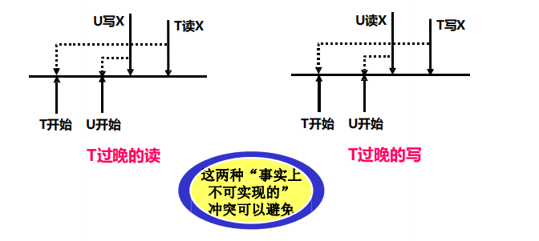

#### 没解决的问题

脏读

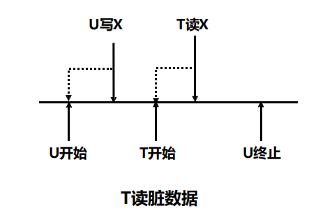


### 调度规则2

托马斯写规则
- 先启动的事务A要写的时候，发现后启动的事务B已经写下去了，那么A的写就不用执行了
- 问题：
  - 如果B写了之后，又撤销 了。那么A写的结果就应该在磁盘中，但实际上并没有
- 解决：
  - 增加一个commit标志位

**C(x): x的提交位。**

**该位为真，当且仅当最近写x的事务已经提交。**
C(x)的目的是避免出现事务读另一事务U所写数据然后U终止这样的情况。

#### 事务读请求

```go
if TS(T) >= WT(x){
    if C(x) {
        同意读
        if TS(T) > RT(X) {
            RT(x) = TS(T)
        }
    }
}else{
    回滚 //过晚的读
}
	
```

#### 事务写请求

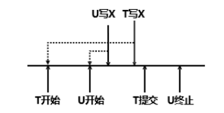

```go
if TS(T) >= RT(X) && TS(T) >= WT(X) {
    同意写
    WT(X) = TS(T)
    C(X) = false
}else if TS(T) >= RT(X) && TS(T) < WT(X) {
    // 过晚的写
    if C(X) {
        continue
    }else{
        推迟T，直到 ( C(X)==true || 写X的事务终止)
    }
}else{
    回滚
}
```


## 基于有效性确认的方法

### 调度器维护三个集合

1. START集合。已经开始但尚未完成有效性确认的事务集合。对此集合中的事务，调度器维护START(T)，即事务T**开始的时间。**
2. VAL集合。已经确认有效性但尚未完成第3阶段写的事务。对此集合中的事务，调度器维护START(T)和VAL(T)，即T**确认的时间。**
3. FIN集合。已经完成第3阶段的事务。对这样的事务T,START(T), VAL(T)和FIN(T)，即T**完成的时间。**

### 事务分三个阶段进行

- 读阶段。
  - 事务从数据库中读取读集合中的所有元素。事务还在其局部地址空间计算它将要写的所有值；部地址空间计算它将要写的所有值；
- 有效性确认阶段。
  - 调度器通过比较该事务与其它事务的读写集合来确认该事务的有效性。
- 写阶段。
  - 事务往数据库中写入其写集合中元素的值。

每个成功确认的事务是在其**有效性确认的瞬间执行**的。

并发事务串行的顺序即事务有效性确认的顺序。

### 有效性确认规则

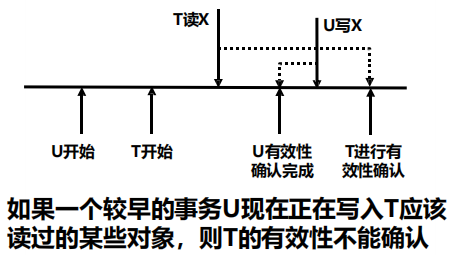

- 对于所有已经过有效性确认, 且在T开始前没有完成的U, 即对于满足 **FIN(U)>START(T)**的U
  - **U 在VAL或FIN中, 即U已经过有效性确认**（前提）
  - **FIN(U)>START(T), 即U在T开始前没有完成**（可能会出现交集）
  - 检测 **U要写的元素** 和 **T要读的元素** 是否有交集
  - 读写冲突

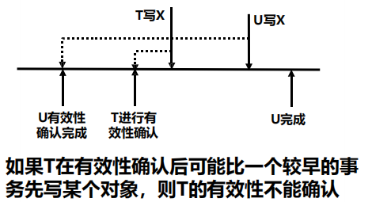

- 对于所有已经过有效性确认，且在T有效性确认前没有完成的U, 即对于满足 **FIN(U)>VAL(T)**的U

  - **U 在VAL, 即U有效性已经成功确认**
  - **FIN(U)>VAL(T), 即U在T进入其有效性确认阶段以前没有完成**

  > 这里用的是VAL，表明U与T开始有效性确认之前，T已经与其他的事务已经确认过了，并且通过了确认

  - 检测 **U要写的元素** 和 **T要写的元素** 是否有交集
  - 写写冲突

总结：需要检查**先启动的U的FIN(U)** <u>是否大于</u> **后启动的T的START(T)以及VAL(T)**。

VAL的作用就是来区分读和写(或许可以理解为读写分离？便于冲突判断)

### 例子

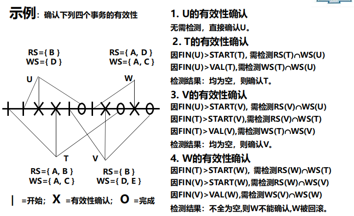

[^这部分的资料较少]: https://www.jianshu.com/p/2f88bfc9a64a?utm_campaign=maleskine&utm_content=note&utm_medium=seo_notes&utm_source=recommendation

